# Small Language Models: Why the Future of AI is Local

## Introduction

For the last several years, the dominant narrative in artificial intelligence
has been governed by scaling laws — the empirical observation that increasing
the number of parameters and the volume of training data leads, almost
inevitably, to better performance. This philosophy gave us models with
hundreds of billions, and eventually trillions, of parameters. But this
relentless scaling comes at a steep cost: enormous energy consumption, expensive
infrastructure, and inference latencies that make real-time or on-device
applications impractical.

The parameters of an LLM are the weights, biases, and other learned values in
the neural network that make one model distinct from another. They are the
values that are modified as a model is trained. The number of parameters a model
has is an extremely rough, but meaningful measurement of its knowledge level and
overall intelligence. In general, although there is reason to believe there may
be diminishing returns in the future, for now increasing the model size creates
improvements in performance and an increase in the breadth of tasks a language
model is able to accomplish.

We are now witnessing a philosophical shift - from "bigger is better" to
"smarter is better." This is the era of the Small Language Model.

## The SLM Paradigm

In this article we'll be talking about Small Language Models (SLMs) — models
that have on the order of millions to 1–4 billion parameters. By contrast,
today's frontier models have on the order of hundreds of billions to trillions
of parameters. Even the smallest mainstream models, such as GPT-4o-mini, have 8
billion parameters.

One of the key advantages of training an SLM is efficiency. Smaller models
require less computational power, consume fewer resources, and can often be
deployed on edge devices. This makes them suitable for specialized applications
where several critical factors come into play:

- **Latency:** SLMs can respond in real time, which is critical for interactive
applications like voice assistants or real-time translation running on local
hardware.
- **Privacy:** On-device processing ensures that sensitive data — medical
records, legal documents, personal communications — never leaves the user's
local environment.
- **Cost:** Reduced hardware requirements mean SLMs can run inference on
consumer-grade CPUs or modest GPUs, dramatically lowering the barrier to
deployment.
- **Specialization:** It is often easier, and more effective, to fine-tune a
small model for a specific vertical — such as medical coding, legal contract
analysis, or customer support — than it is to steer a massive generalist model
toward a narrow task.

Models like Microsoft's Phi-3, Mistral 7B, and TinyLlama have demonstrated that
carefully constructed small models can punch well above their weight class,
rivaling models many times their size on targeted benchmarks. Think of a massive
LLM as a generalist professor with broad but sometimes shallow knowledge, while
an SLM is more like a highly trained apprentice - deeply skilled within its
domain and far more efficient to employ.

## The Data Revolution: Quality Over Quantity

Perhaps the single most important factor in training a successful SLM is the
quality of the data it learns from. While massive LLMs can afford a "brute
force" approach - crawling the entire internet and relying on sheer volume
to wash out noise - SLMs do not have that luxury. Every parameter must work
harder, which means every training example must count.

Recent research, particularly Microsoft's Phi series, has demonstrated a
powerful insight: a model trained on a curated corpus of high-quality,
reasoning-dense text can outperform a model trained on a dataset many times
larger but filled with low-quality noise. The researchers called this the
"textbook quality" approach, drawing an analogy to the difference between
studying from a well-written textbook versus reading random pages from the
internet.

This philosophy has several practical implications. First, **data curation**
becomes paramount. Rather than ingesting raw web scrapes, teams invest heavily
in filtering pipelines that score, rank, and select training examples based
on coherence, factual accuracy, and reasoning depth. Second, **synthetic data
generation** has emerged as a critical technique. Larger, more capable models
can be used to generate structured training examples - step-by-step reasoning
chains, question-answer pairs, or code explanations - that are specifically
designed to teach the smaller model how to think, not just what to say.

However, the use of synthetic data is not without controversy. There is growing
concern about the risk of "model collapse" - a phenomenon where models trained
primarily on AI-generated data begin to degrade, losing the diversity and nuance
found in human-generated text. Striking the right balance between synthetic and
organic data remains an active area of research, and teams training SLMs must be
deliberate about maintaining dataset diversity to avoid this pitfall.

The bottom line is clear: for SLMs, the data pipeline is not a preprocessing
step. It is the single most consequential engineering decision in the entire
project.

## Architectural Design and Distillation

### Architecture Choices

Building an effective SLM is not simply a matter of shrinking a large model. The
architecture must be deliberately designed to maximize performance under tight
parameter budgets.

One widely adopted technique is **Grouped Query Attention (GQA)**, which reduces
the size of the key-value (KV) cache during inference. The KV cache is the
primary memory bottleneck when processing long sequences, and in small-memory
environments — such as a smartphone or a Raspberry Pi — minimizing it is
essential. GQA achieves this by sharing key and value heads across multiple
query heads, dramatically reducing memory bandwidth requirements without a
proportional loss in quality.

Another architectural consideration is the choice between **dense** and
**Mixture of Experts (MoE)** architectures. In a dense model, every parameter
is activated for every input. In an MoE model, only a subset of specialized
"expert" sub-networks are activated for any given token, meaning the model can
have a large total parameter count while keeping the *active* parameter count
— and therefore the inference cost — small. This approach allows SLMs to
maintain breadth of knowledge while staying computationally lean.

Weight sharing, efficient embedding strategies, and careful choices about model
depth versus width all contribute to squeezing maximum capability from a limited
parameter budget.

### Knowledge Distillation

The basic idea of distillation is that a larger model acts as a teacher,
guiding the training of a smaller student model. Rather than learning only
from traditional datasets, the smaller model learns from the responses and
behavior of the larger model. This allows it to capture patterns, knowledge, and
decision-making strategies that would otherwise be difficult to learn directly.

In modern distillation pipelines, the teacher model does more than simply
provide final answers. It generates structured reasoning paths -
Chain-of-Thought explanations that walk through a problem step by step. The
student model is then trained not just to replicate the teacher's outputs, but
to replicate its *reasoning process*. This is what allows a 3-billion-parameter
model to exhibit reasoning abilities that seem disproportionate to its size.

Distillation can capture a surprisingly large amount of the performance of the
larger model and make it much cheaper to run in production. But distillation
is not a perfect process. Some information is inevitably lost when compressing
a model. Complex reasoning abilities, nuanced knowledge, or strong performance
on specialized tasks may not transfer completely. The art lies in choosing
the right teacher, designing the right training curriculum, and knowing which
capabilities to prioritize.

## Training, Optimization, and Quantization

### Pre-training and Fine-tuning

The mechanics of training an SLM follow a familiar two-stage pipeline. During
**pre-training**, the model learns general language understanding through a
next-token prediction objective — given a sequence of text, predict what comes
next. This stage builds the model's foundational knowledge of grammar, facts,
and reasoning patterns.

**Fine-tuning** then adapts the pretrained model to perform better on a
specific task, domain, or style of communication. Unlike training from scratch,
fine-tuning leverages the knowledge already embedded in the model, significantly
reducing computational requirements and training time.

The first step in fine-tuning is preparing a high-quality dataset that reflects
the target behavior. Data quality is often more important than quantity. For
example, a model intended for customer support should be trained on accurate
support conversations, FAQs, and resolution examples.

Hyperparameter tuning plays a critical role in achieving optimal results.
Learning rate, batch size, number of epochs, and weight decay can dramatically
influence model behavior. Excessive training may lead to overfitting, where the
model memorizes training examples rather than learning generalizable patterns.
Monitoring validation loss and evaluating on held-out datasets help identify the
best stopping point.

Beyond traditional supervised fine-tuning, modern alignment techniques like
**Direct Preference Optimization (DPO)** allow practitioners to shape model
behavior based on human preferences — teaching the model not just *what* to
say, but *how* to say it in a way that is helpful, harmless, and honest.

### Quantization: The Deployment Bridge

Training a capable SLM is only half the battle. To make it viable on a phone,
laptop, or embedded device, the model must be **quantized** - a process that
reduces the numerical precision of its weights from 16-bit floating point
numbers to 4-bit or 8-bit integers. This can reduce the model's memory footprint
by 75% or more, with surprisingly modest impacts on output quality.

Several quantization formats have emerged, each with its own trade-offs.
**GGUF** is popular for CPU-based inference and is widely supported by tools
like llama.cpp. **AWQ** (Activation-aware Weight Quantization) preserves
accuracy by paying special attention to the most important weights. **EXL2**
offers flexible mixed-precision quantization for GPU inference. The choice of
format depends on the target hardware and the acceptable trade-off between
inference speed and output quality.

The hardware landscape itself is evolving to meet SLMs halfway. Apple Silicon's
Neural Engine, NVIDIA's Jetson platform for edge AI, and even Raspberry Pi
devices are increasingly capable of running quantized SLMs at interactive
speeds, bringing generative AI to contexts where cloud connectivity is
unreliable, expensive, or simply unacceptable from a privacy standpoint.

## Evaluation and Deployment

How do you know if your SLM is actually good? Standard benchmarks like MMLU,
HellaSwag, and HumanEval provide useful reference points, but they come with
significant caveats. Benchmark contamination — where test questions leak into
training data — is a persistent concern, and high benchmark scores do not
always translate to real-world utility.

Beyond accuracy alone, an SLM should be evaluated across the practical
trade-offs between **accuracy, latency, and cost**. Accuracy can be measured
using task-specific metrics such as exact-match or F1 score for classification
and question answering, pass@k for code generation, and human ratings for
subjective outputs. **Latency** should be measured as time-to-first-token
(TTFT) and tokens-per-second (TPS), ideally reported as median and p95 latency
over a representative set of prompts rather than a single average. **Cost**
can be measured as dollars per million input and output tokens, or as cost per
completed task, including the hardware and infrastructure required to run the
model. 

For SLMs, the most meaningful evaluation is often **domain-specific and
human-in-the-loop**. If the model is meant to be a coding assistant, it
should be tested on realistic coding tasks by actual developers. If it is
a medical triage tool, it should be evaluated by clinicians against real
patient scenarios. The "vibe check" - does this model actually feel useful
in practice? - remains an underrated but essential complement to automated
metrics.

## Conclusion

It is also possible to train an SLM entirely from scratch. However, the process
is extremely intricate and difficult to get right, and it is challenging
to provide a substantial improvement over distillation and fine-tuning
without significant expertise and resources. HuggingFace's [SmolLM Training
Playbook](https://huggingface.co/spaces/HuggingFaceTB/smol-training-playbook)
provides an exhaustive guide to the best ways to accomplish it, if you're
interested.

Whichever approach you choose - fine-tuning, distillation, or training
from scratch - SLMs represent a fundamental shift in how we think about AI
deployment. They are proof that intelligence is not just a function of scale,
but of design, data quality, and engineering discipline. As hardware continues
to improve and training techniques mature, the future of AI is lean, local,
and sustainable. Small Language Models are a versatile and exciting method of
utilizing Generative AI systems in practical, real-world applications where
efficiency and specialization matter most.

## Summary Diagram

```mermaid
flowchart TD
    A([Start: Build an SLM]) --> B{What is the goal?}

    B -->|Specialized task / domain| C[Use an existing pretrained model]
    B -->|Need highly customized capabilities| D{Do you have substantial<br/>expertise and resources?}

    C --> E{Need to transfer capabilities<br/>from a larger model?}
    E -->|Yes| F[Knowledge Distillation]
    E -->|No| G[Fine-tuning]

    D -->|Yes| H[Train from Scratch]
    D -->|No| F

    %% Data pipeline
    F --> I[Build a high-quality,<br/>curated dataset]
    G --> I
    H --> I

    I --> J{How will training data<br/>be produced?}
    J -->|Human / organic data| K[Curate and filter for<br/>quality, accuracy, coherence]
    J -->|Synthetic data| L[Generate structured examples<br/>with a larger teacher model]
    J -->|Both| M[Balance synthetic +<br/>organic data]

    L --> N{Maintain dataset diversity<br/>and avoid model collapse?}
    M --> N
    K --> O[Training data ready]
    N --> O

    %% Architecture
    O --> P{Choose architecture}
    P --> Q[Optimize parameter budget]
    Q --> R{Memory-constrained<br/>deployment?}
    R -->|Yes| S[Use GQA to reduce<br/>KV-cache memory]
    R -->|No| T[Choose dense or MoE<br/>based on compute needs]

    S --> U[Consider depth vs width,<br/>weight sharing, embeddings]
    T --> U

    %% Training
    U --> V{Training approach}
    V -->|Pre-training| W[Next-token prediction<br/>for foundational knowledge]
    V -->|Fine-tuning| X[Train on target-task/domain data]
    V -->|Distillation| Y[Student learns from<br/>teacher responses/reasoning]

    W --> Z[Hyperparameter tuning]
    X --> Z
    Y --> Z

    Z --> AA[Monitor validation loss<br/>and held-out evaluation]
    AA --> AB{Need behavior alignment?}
    AB -->|Yes| AC[DPO / preference optimization]
    AB -->|No| AD[Continue]

    AC --> AD

    %% Deployment
    AD --> AE{Where will the SLM run?}
    AE -->|Phone / embedded / CPU| AF[Quantize]
    AE -->|GPU| AG[Choose suitable precision<br/>and quantization]
    AE -->|Cloud / larger hardware| AH[Deploy with available precision]

    AF --> AI{Target hardware}
    AG --> AI
    AI -->|CPU-oriented| AJ[GGUF]
    AI -->|GPU / accuracy-sensitive| AK[AWQ]
    AI -->|GPU / mixed precision| AL[EXL2]

    AJ --> AM[Deploy]
    AK --> AM
    AL --> AM
    AH --> AM

    %% Evaluation loop
    AM --> AN[Evaluate]
    AN --> AO{Does it work well<br/>in the real target domain?}

    AO -->|No| AP[Improve data / architecture /<br/>training / hyperparameters]
    AP --> I

    AO -->|Yes| AQ[Human-in-the-loop<br/>domain-specific evaluation]
    AQ --> AR{Meets practical requirements?}

    AR -->|No| AP
    AR -->|Yes| AS([Production SLM])

    %% Styling
    classDef decision fill:#fff,stroke:#333,stroke-width:2px;
    classDef process fill:#f5f5f5,stroke:#555;
    classDef endpoint fill:#e8e8e8,stroke:#333,stroke-width:2px;

    class B,D,E,J,N,P,R,V,AB,AE,AI,AO,AR decision;
    class C,F,G,H,I,K,L,M,O,Q,S,T,U,W,X,Y,Z,AC,AD,AF,AG,AH,AJ,AK,AL,AM,AN,AP,AQ process;
    class A,AS endpoint;
```

